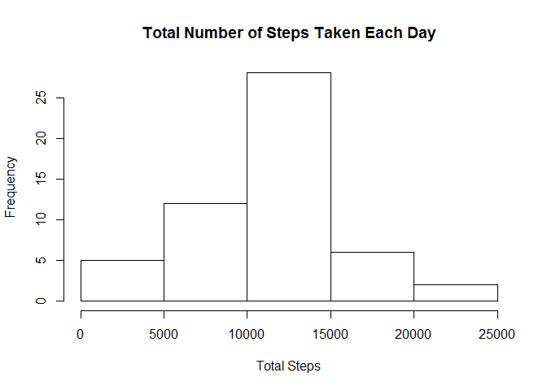
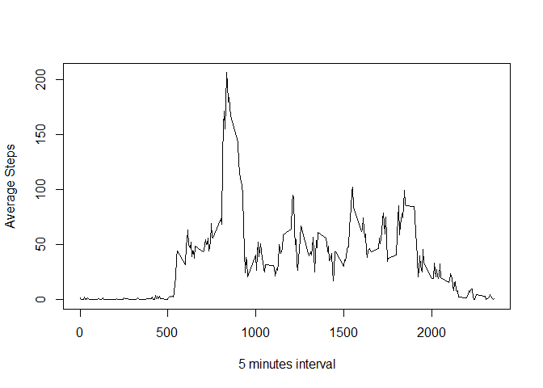
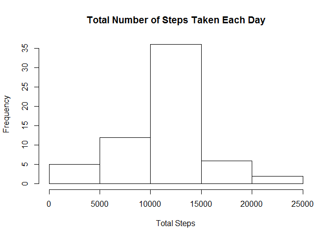
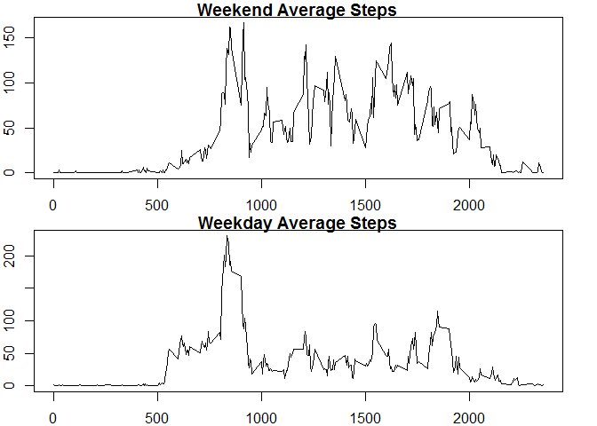

# Reproducible Research: Peer Assessment 1


## Loading and preprocessing the data
Set your working directory

setwd("[your working directory]")


```r
stepsData <- read.csv("activity/activity.csv")
```

Process the data to remove NAs from the dataset and convert date as date

```r
processData <- na.omit(stepsData)
processData$date <- as.Date(processData$date)
```

## What is mean total number of steps taken per day?
Calculate the total steps taken per day

```r
totalSteps <- tapply(processData$steps, processData$date, sum)
```

Plot the histogram of the total number of steps taken per day

```r
par(mfrow=c(1,1))
hist(totalSteps, xlab="Total Steps", main="Total Number of Steps Taken Each Day")
```

<!-- -->

Calculate the mean and median total number of steps taken per day

```r
summary(totalSteps, digits =5)
```

```
##    Min. 1st Qu.  Median    Mean 3rd Qu.    Max. 
##      41    8841   10765   10766   13294   21194
```

The median is 10765 and Mean is 10766

## What is the average daily activity pattern?

Make a time series plot (i.e. type = "l") of the 5-minute interval (x-axis)
and the average number of steps taken, averaged across all days (y-axis)


```r
aggrSteps <- aggregate(processData$steps, by=list(processData$interval), FUN=mean)
names(aggrSteps) <- c("interval", "averagesteps")
par(mfrow=c(1,1))
plot(aggrSteps$interval, aggrSteps$averagesteps, type="l", xlab="5 minutes interval", ylab="Average Steps")
```

<!-- -->

Which 5-minute interval, on average across all the days in the dataset,
contains the maximum number of steps?


```r
summary(aggrSteps$averagesteps)
```

```
##    Min. 1st Qu.  Median    Mean 3rd Qu.    Max. 
##   0.000   2.486  34.110  37.380  52.830 206.200
```

The maximum number of steps is 206.2


```r
aggrSteps[aggrSteps$averagesteps>=max(aggrSteps$averagesteps),1]
```

```
## [1] 835
```
835 interval contains the maximum number of steps

## Imputing missing values

Calculate and report the total number of missing values in the dataset


```r
summary(stepsData)
```

```
##      steps                date          interval     
##  Min.   :  0.00   2012-10-01:  288   Min.   :   0.0  
##  1st Qu.:  0.00   2012-10-02:  288   1st Qu.: 588.8  
##  Median :  0.00   2012-10-03:  288   Median :1177.5  
##  Mean   : 37.38   2012-10-04:  288   Mean   :1177.5  
##  3rd Qu.: 12.00   2012-10-05:  288   3rd Qu.:1766.2  
##  Max.   :806.00   2012-10-06:  288   Max.   :2355.0  
##  NA's   :2304     (Other)   :15840
```

```r
sum(is.na(stepsData))
```

```
## [1] 2304
```

Fill the missing valus NAs with the mean of 5 minute intervals

Left join the mean data to the original data

```r
mergeData <- merge(stepsData, aggrSteps, by = "interval")
```


Create a new data set with the imputed data

```r
finalData <- transform(mergeData, steps = ifelse(is.na(steps), averagesteps, steps))
finalData <- subset(finalData, select=-averagesteps)
```

Calculate the total steps taken per day

```r
totalSteps <- tapply(finalData$steps, finalData$date, sum)
```

Plot the histogram of the total number of steps taken per day

```r
par(mfrow=c(1,1))
hist(totalSteps, xlab="Total Steps", main="Total Number of Steps Taken Each Day")
```

<!-- -->

Calculate the mean and median total number of steps taken per day

```r
summary(totalSteps, digits =5)
```

```
##    Min. 1st Qu.  Median    Mean 3rd Qu.    Max. 
##      41    9819   10766   10766   12811   21194
```

The median is 10766 and Mean is 10766. The mean is unchanged however imputing the data with average interval changed the median

## Are there differences in activity patterns between weekdays and weekends?

Create a new factor variable in the dataset with two levels - "weekday"
and "weekend" indicating whether a given date is a weekday or weekend
day.

```r
lastData <- transform(finalData, day=ifelse(grepl("S(at|un)", weekdays(as.Date(finalData$date), abbr = TRUE)), "weekend", "weekday"))

weekendSteps <- lastData[lastData$day=="weekend",]
weekdaySteps <- lastData[lastData$day=="weekday",]

weekendaggrSteps <- aggregate(weekendSteps$steps, by=list(weekendSteps$interval), FUN=mean)
weekdayaggrSteps <- aggregate(weekdaySteps$steps, by=list(weekdaySteps$interval), FUN=mean)

names(weekendaggrSteps) <- c("interval", "averagesteps")
names(weekdayaggrSteps) <- c("interval", "averagesteps")
```

Plot the 5-minute interval (x-axis) and the average number of steps taken, averaged across all weekday days or weekend days (y-axis)

```r
par(mfrow=c(2,1), mar=c(2,2,1,2))
plot(weekendaggrSteps$interval, weekendaggrSteps$averagesteps, type="l", main="Weekend Average Steps")
plot(weekdayaggrSteps$interval, weekdayaggrSteps$averagesteps, type="l", main="Weekday Average Steps")
```

<!-- -->
